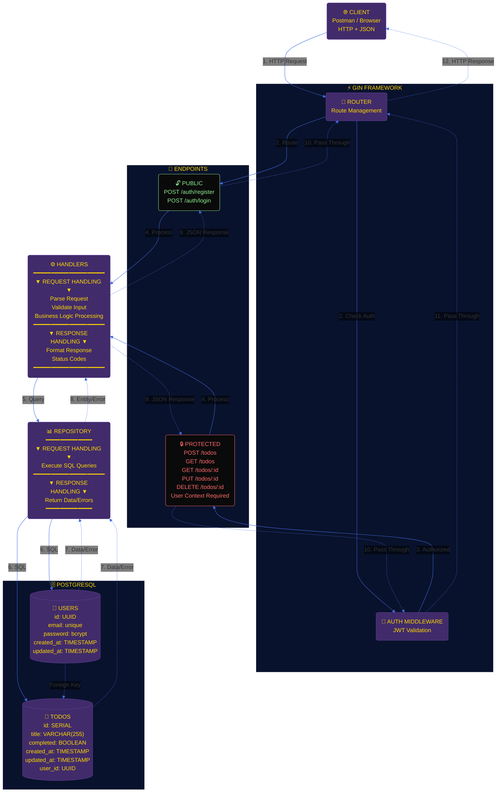

# Go REST API Request-Response Flow

```mermaid
%%{init: {'themeVariables': {'edgeLabelBackground':'transparent', 'clusterBkg':'transparent'}}}%%

flowchart TB
    Client("🌐 CLIENT<br/>Postman / Browser<br/>HTTP + JSON")

    subgraph GinFramework["⚡ GIN FRAMEWORK"]
        Router("🔀 ROUTER<br/>Route Management")
        Auth("🔐 AUTH MIDDLEWARE<br/>JWT Validation")
    end

    subgraph Routes["📍 ENDPOINTS"]
        PublicRoutes("🔓 PUBLIC<br/>POST /auth/register<br/>POST /auth/login")
        ProtectedRoutes("🔒 PROTECTED<br/>POST /todos<br/>GET /todos<br/>GET /todos/:id<br/>PUT /todos/:id<br/>DELETE /todos/:id<br/>User Context Required")
    end


   Handlers("⚙️ HANDLERS<br/>━━━━━━━━━━━━━━━━━━━━<br/>▼ REQUEST HANDLING ▼<br/>Parse Request<br/>Validate Input<br/>Business Logic Processing<br/>━━━━━━━━━━━━━━━━━━━━<br/>▼ RESPONSE HANDLING ▼<br/>Format Response<br/>Status Codes<br/>━━━━━━━━━━━━━━━━━━━━")

Repository("📊 REPOSITORY<br/>━━━━━━━━━━━━━<br/>▼ REQUEST HANDLING ▼<br/>Execute SQL Queries<br/>━━━━━━━━━━━━━━━━━━━━<br/>▼ RESPONSE HANDLING ▼<br/>Return Data/Errors<br/>━━━━━━━━━━━━━")

    subgraph Database["🗄️ POSTGRESQL"]
        Users[("👤 USERS<br/>id: UUID<br/>email: unique<br/>password: bcrypt<br/>created_at: TIMESTAMP<br/>updated_at: TIMESTAMP")]
        Todos[("📝 TODOS<br/>id: SERIAL<br/>title: VARCHAR(255)<br/>completed: BOOLEAN<br/>created_at: TIMESTAMP<br/>updated_at: TIMESTAMP<br/>user_id: UUID")]
    end

    %% REQUEST FLOW - with proper spacing
    Client ===>|"1. HTTP Request"| Router
    Router --->|"2. Route"| PublicRoutes
    Router --->|"2. Check Auth"| Auth
    Auth --->|"3. Authorized"| ProtectedRoutes

    PublicRoutes ===>|"4. Process"| Handlers
    ProtectedRoutes ===>|"4. Process"| Handlers

    Handlers ===>|"5. Query"| Repository

    Repository ===>|"6. SQL"| Users
    Repository ===>|"6. SQL"| Todos

    %% RESPONSE FLOW - with proper spacing
    Users -.->|"7. Data/Error"| Repository
    Todos -.->|"7. Data/Error"| Repository

    Repository -.->|"8. Entity/Error"| Handlers

    Handlers -.->|"9. JSON Response"| ProtectedRoutes
    Handlers -.->|"9. JSON Response"| PublicRoutes

    ProtectedRoutes -.->|"10. Pass Through"| Auth
    PublicRoutes -.->|"10. Pass Through"| Router
    Auth -.->|"11. Pass Through"| Router

    Router -.->|"12. HTTP Response"| Client

    %% Foreign Key Relationship
    Users -.->|"Foreign Key"| Todos

    style Client fill:#412B6B,stroke:#5C3E94,stroke-width:1px,color:#FFD700
    style Router fill:#412B6B,stroke:#5C3E94,stroke-width:1px,color:#FFD700
    style Auth fill:#412B6B,stroke:#5C3E94,stroke-width:1px,color:#FFD700
    style PublicRoutes fill:#0a0a0a,stroke:#90EE90,stroke-width:1px,color:#90EE90
    style ProtectedRoutes fill:#0a0a0a,stroke:#FF6B6B,stroke-width:1px,color:#FF6B6B
    style Handlers fill:#412B6B,stroke:#5C3E94,stroke-width:1px,color:#FFD700
    style Repository fill:#412B6B,stroke:#5C3E94,stroke-width:1px,color:#FFD700
    style Users fill:#412B6B,stroke:#5C3E94,stroke-width:1px,color:#FFD700
    style Todos fill:#412B6B,stroke:#5C3E94,stroke-width:1px,color:#FFD700
    style GinFramework fill:#09122C,stroke:transparent,stroke-width:1px,color:#FFD700
    style Routes fill:#09122C,stroke:transparent,stroke-width:1px,color:#FFD700
    style Database fill:#09122C,stroke:transparent,stroke-width:1px,color:#FFD700

    %% Link styling for blue borders on labels
    linkStyle 0 stroke:#4169E1,stroke-width:1px,fill:none
    linkStyle 1 stroke:#4169E1,stroke-width:1px,fill:none
    linkStyle 2 stroke:#4169E1,stroke-width:1px,fill:none
    linkStyle 3 stroke:#4169E1,stroke-width:1px,fill:none
    linkStyle 4 stroke:#4169E1,stroke-width:1px,fill:none
    linkStyle 5 stroke:#4169E1,stroke-width:1px,fill:none
    linkStyle 6 stroke:#4169E1,stroke-width:1px,fill:none
    linkStyle 7 stroke:#4169E1,stroke-width:1px,fill:none
    linkStyle 8 stroke:#4169E1,stroke-width:1px,fill:none
    linkStyle 9 stroke:#4169E1,stroke-width:1px,fill:none
    linkStyle 10 stroke:#4169E1,stroke-width:1px,fill:none
    linkStyle 11 stroke:#4169E1,stroke-width:1px,fill:none
    linkStyle 12 stroke:#4169E1,stroke-width:1px,fill:none
    linkStyle 13 stroke:#4169E1,stroke-width:1px,fill:none
    linkStyle 14 stroke:#4169E1,stroke-width:1px,fill:none
    linkStyle 15 stroke:#4169E1,stroke-width:1px,fill:none
    linkStyle 16 stroke:#4169E1,stroke-width:1px,fill:none
    linkStyle 17 stroke:#4169E1,stroke-width:1px,fill:none
    linkStyle 18 stroke:#4169E1,stroke-width:1px,fill:none
```
